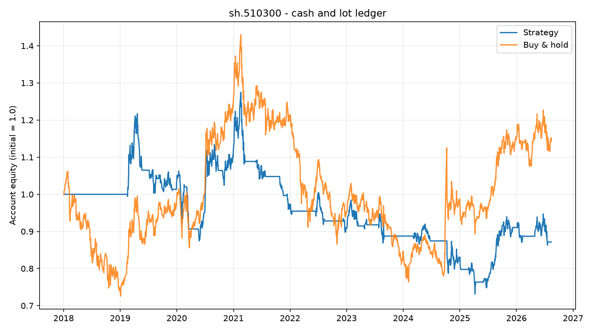

# A-Share Quant Lab｜A股量化研究实验室

[](https://github.com/Zhaolong666520/a-share-quant-lab/actions/workflows/ci.yml)
[](https://www.python.org/)
[](https://github.com/Zhaolong666520/a-share-quant-lab/releases)
[](LICENSE)
[](https://github.com/Zhaolong666520/a-share-quant-lab/stargazers)


一个面向初学者的、**可复现且可审计**的 A 股量化研究实验室。它不负责告诉你“明天买什么”，而是帮助你把数据来源、实验参数、交易成本、执行限制和现金账本逐项对清楚。

> Reproducible and auditable A-share research in Python: data health, walk-forward analysis, cost stress, execution constraints, and a cash/lot/fee ledger.

如果这个项目帮你避开了一个回测陷阱，欢迎点一下 **Star**；它会让我知道哪些方向值得继续完善。

## 为什么值得收藏

- **拒绝未来函数**：信号至少延迟到下一交易日执行，并用逐行检查守住边界。
- **数据有身份证**：每份正式数据都有 SHA-256、数据集 ID、来源、采集时间、复权方式和陈旧状态。
- **不只看一条漂亮曲线**：固定参数后依次做样本外、滚动窗口、成本、参数和执行可行性压力测试。
- **按真实账户约束记账**：现金、100 份整手、最低佣金、卖出税费和滑点逐日对账。
- **亏损结果也保留**：项目明确禁止删除落后基准的实验，也不把合成数据冒充真实行情。
- **Windows 友好**：常用流程都提供可双击的 `.cmd`，同时保留完整 Python CLI。

## 它解决什么问题

很多回测“看起来能赚钱”，只是因为它无意中偷看了未来、忽略了成本，或只展示最漂亮的一组参数。这个项目把研究流程拆成一条可以检查的证据链：

```text
原始快照 → 数据校验/指纹 → 固定实验 → 样本外检验
         → 成本/参数/执行压力 → 现金账本 → HTML/JSON/CSV 报告
```

| 能力 | 项目如何处理 |
| --- | --- |
| 数据接入 | AKShare 获取 A 股指数与 ETF 日线；BaoStock 用于抽样核对 |
| 数据存储 | 不可变原始快照、规范 Parquet、DuckDB |
| 数据健康 | 重复日期、OHLC 关系、空值、异常间隔、陈旧状态、来源失败 |
| 基础回测 | 买入持有与双均线；信号次日执行并扣除成本 |
| 稳健性 | 固定切分、walk-forward、成本压力、参数热力图 |
| 执行压力 | 额外延迟与事后日线阻塞代理；受阻订单保留原仓位 |
| 账户账本 | 现金、整手、最低佣金、卖出费用、滑点和逐日对账 |
| 研究产物 | 中文 HTML、净值图、逐笔 CSV、机器可读 JSON |

## 一个诚实的结果示例



实验 006 中，固定的 20/60 双均线在所用数据与费用假设下得到 **-12.84%**，同期买入持有为 **+14.43%**。这张图不是策略推荐，而是在说明：本项目会保留不漂亮的结果，并要求现金、份额、费用与权益全部对账通过。完整假设见 [`experiments/006_data_and_account_ledger.md`](experiments/006_data_and_account_ledger.md)。

## 3 分钟开始

### 方式一：Windows 双击运行

1. 安装 Python 3.11、3.12 或 3.13。
2. 双击 `run_demo.cmd`。首次运行会创建 `.venv` 并安装依赖。
3. 打开 `outputs\demo_000300_sma_report.html`。

离线演示使用明确标记的合成数据，不需要行情网络，只用于理解指标和确认环境正常。

### 方式二：PowerShell / CLI

```powershell
git clone https://github.com/Zhaolong666520/a-share-quant-lab.git
cd a-share-quant-lab
.\scripts\setup.ps1
.\.venv\Scripts\python.exe -m finance_lab.cli demo
```

验证整个项目：

```powershell
.\verify.cmd
```

## 建议学习路线

| 阶段 | 先读 | 再运行 | 你要回答的问题 |
| --- | --- | --- | --- |
| 1. 回测基础 | [`第一课`](docs/第一课.md) | `run_demo.cmd` | 收益、回撤和基准分别说明什么？ |
| 2. 样本外 | [`第二课`](docs/第二课.md) | `run_experiment.cmd` | 参数是否在看结果前固定？ |
| 3. 滚动检验 | [`第三课`](docs/第三课.md) | `run_walk_forward.cmd` | 结论是否只依赖某一个历史区间？ |
| 4. 成本压力 | [`第四课`](docs/第四课.md) | `run_cost_stress.cmd` | 成本提高后结果是否单调变差？ |
| 5. 参数稳健性 | [`第五课`](docs/第五课.md) | `run_parameter_test.cmd` | 好结果是连续区域还是孤立参数点？ |
| 6. 执行可行性 | [`第六课`](docs/第六课.md) | `run_execution_test.cmd` | 延迟和受阻会改变多少结果？ |
| 7. 数据与账本 | [`第七课`](docs/第七课.md) | `run_data_health.cmd` → `run_account.cmd` | 数据身份和账户余额能否逐项对上？ |

<details>
<summary><strong>展开：真实数据与全部命令</strong></summary>

### 更新真实数据

双击 `update_data.cmd`。程序默认从 2018 年开始尝试更新示例标的。外部数据源失败时，它会记录原因并尝试备用来源，不会伪造行情。

### 常用命令

```powershell
.\.venv\Scripts\python.exe -m finance_lab.cli demo
.\.venv\Scripts\python.exe -m finance_lab.cli fetch --start 2018-01-01
.\.venv\Scripts\python.exe -m finance_lab.cli validate
.\.venv\Scripts\python.exe -m finance_lab.cli backtest --symbol sh.000300
.\.venv\Scripts\python.exe -m finance_lab.cli experiment-all --split-date 2023-01-01
.\.venv\Scripts\python.exe -m finance_lab.cli walk-forward-all --first-oos-date 2021-01-01
.\.venv\Scripts\python.exe -m finance_lab.cli cost-stress-all --costs 5,10,20,50
.\.venv\Scripts\python.exe -m finance_lab.cli parameter-test-all --shorts 10,20,30 --longs 40,60,90
.\.venv\Scripts\python.exe -m finance_lab.cli execution-test-all --delay-days 1 --lock-threshold 0.095
.\.venv\Scripts\python.exe -m finance_lab.cli manifest
.\.venv\Scripts\python.exe -m finance_lab.cli account --symbol sh.510300
```

### 输出文件

所有报告写入 `outputs/`。正式实验 ID 会包含引擎版本、参数、切分、成本和数据指纹，避免不同实验静默覆盖。数据健康报告命名示例：

```text
dataset_manifest_<数据集ID前12位>_r<检查上下文哈希>_report.html
```

</details>

## 研究护栏

本仓库的 [`AGENTS.md`](AGENTS.md) 不只是协作说明，也是研究纪律：

1. 原始数据只新增快照，不静默覆盖。
2. 信号至少延迟到下一交易日，禁止未来函数。
3. 看过样本外结果后，不修改同一实验的切分或参数。
4. 费率、税率和涨跌停代理若没有权威规则，只能标为假设情景。
5. 亏损或落后基准的实验必须保留。
6. 正式报告必须先通过代码测试、数据校验和一致性检查。

## 项目结构

```text
a-share-quant-lab/
├─ AGENTS.md               AI 与研究协作规则
├─ config/                 标的与账户配置
├─ data/raw/               原始快照（不进入 Git）
├─ data/curated/           规范数据（不进入 Git）
├─ docs/                   七节中文课程与数据说明
├─ experiments/            固定参数、假设和全部结论
├─ outputs/                HTML / PNG / JSON / CSV
├─ research/               研究资料与新假设
├─ scripts/                Windows 运行、验证与打包脚本
├─ src/finance_lab/        Python 实现
└─ tests/                  自动化测试
```

Python 包和命令行名称仍保留为 `finance-lab` / `finance_lab`，避免已有脚本和安装方式失效；GitHub 仓库品牌名为 **A-Share Quant Lab**。

## 当前边界

- 目前以日线教学为主，不处理分钟、逐笔和实时行情。
- 执行阻塞是收盘后可知的事后日线压力代理，不是开盘可知的交易所规则。
- ETF 使用不复权数据，账户模型尚未处理分红、除权现金流、部分成交、排队和市场冲击。
- 陈旧度按工作日近似，尚未接入交易所完整交易日历。
- AKShare 与 BaoStock 是研究级公共接口，不提供生产级稳定性保证。
- 双均线只是用于验证研究流程的教学基准，不能据此直接买卖。

## 路线图

- [ ] 交易所交易日历与节假日感知的数据健康检查
- [ ] 分红、除权和现金分配账本
- [ ] 更多不依赖“最佳参数”的基准策略
- [ ] Linux/macOS 一键脚本与容器化环境
- [ ] 可选的分钟线研究层（与日线证据链分离）

欢迎通过 [Issue](https://github.com/Zhaolong666520/a-share-quant-lab/issues) 提建议，或阅读 [`CONTRIBUTING.md`](CONTRIBUTING.md) 提交 PR。尤其欢迎数据质量、未来信息、费用口径和边界条件方面的审查。

## 发布包

`scripts/package_release.ps1` 会生成 `a-share-quant-lab-source-v0.7.0.zip`。源码包不重新分发第三方行情，只保留空的 `data/` 与 `outputs/`，因此不能单独复现实验 006 的精确历史结果。请用实验记录中的数据集 ID 和 SHA-256 核对你依法取得的数据快照。

## 许可证与免责声明

代码以 [MIT License](LICENSE) 开源。行情数据及其使用权仍受各数据提供方条款约束，不因代码许可证而改变。

本项目仅用于学习与研究，不连接券商、不自动交易、不构成投资建议。历史结果、合成数据和压力情景都不代表未来表现。
